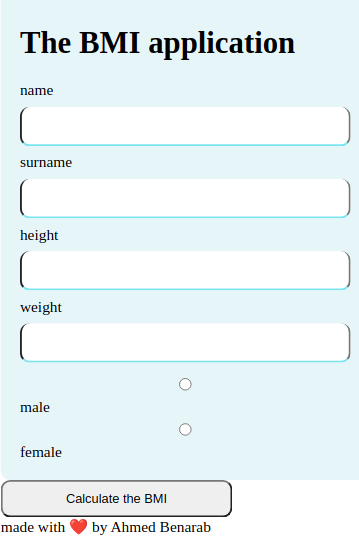
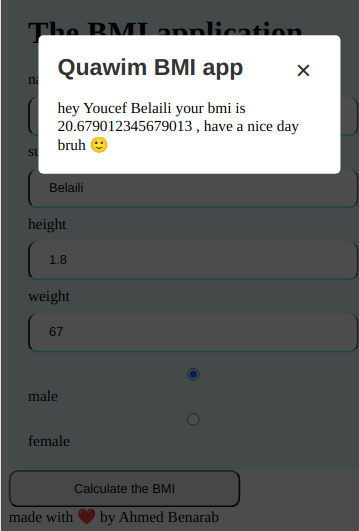

# BMI Application

What is it ?
===
The BMI app is a calculator for body mass index 

**BMI** stand for => body mass index 
    : a value derived from the mass (weight) and height of a person. The BMI is defined as the body mass divided by the square of the body height, and is expressed in units of kg/m2, resulting from mass in kilograms and height in metres. [to learn more check](https://www.wikiwand.com/en/Body_mass_index)

---
## the Algorithm behind 

it's simple , we take the weight and the height then we applie the function bellow 

> BMI = weight / (heigh²) 

 ## the aim of this app

 - [X] ~~show the result of a bmi in clear font~~
 - [ ] add graph for normal and abnormal values
 - [X] ~~add clear input boxes~~
 - [ ] aesthetics 

 ## How it works ?
 you just need to put your informaiton and then clic on "Calculate the BMI"

 

 after clicking on the button 
 
 a new window will pop up showing you your bmi 

 

