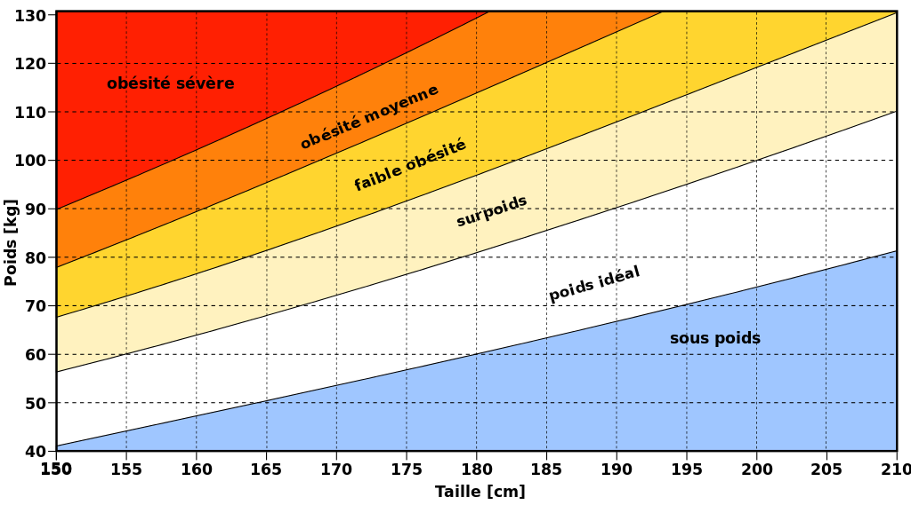

# BMI

What is it ?
===
The BMI app is the an application that means to calculate the BMI (body mass index)

**BMI** stand for
    : a value derived from the mass (weight) and height of a person. The BMI is defined as the body mass divided by the square of the body height, and is expressed in units of kg/m2, resulting from mass in kilograms and height in metres. [to learn more check](https://www.wikiwand.com/en/Body_mass_index)

---
## the Algorithm behind 

it's simple , we take the weight and the height then we applie the function bellow 

> BMI = weight / (heigh^2) 

